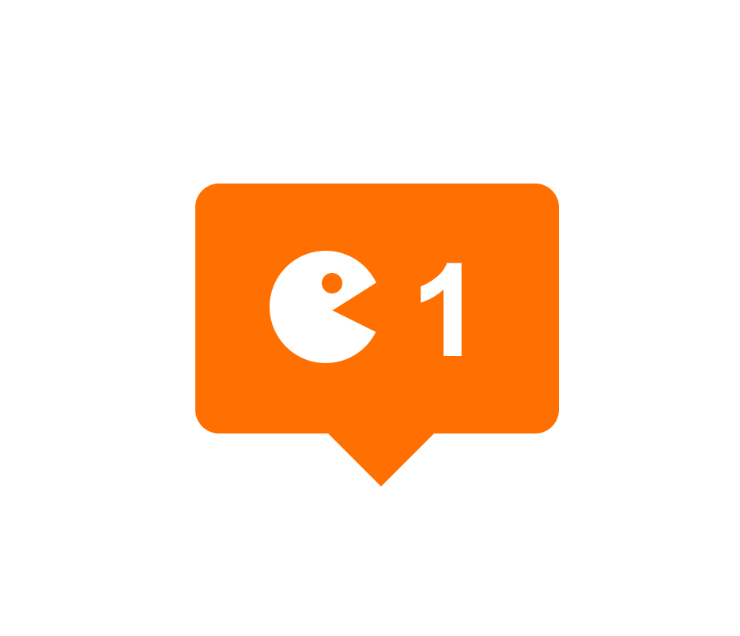
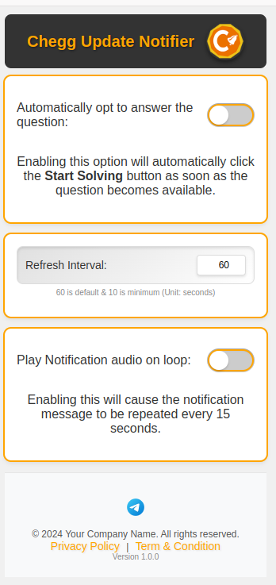
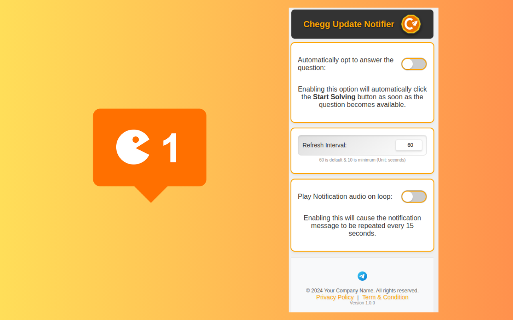
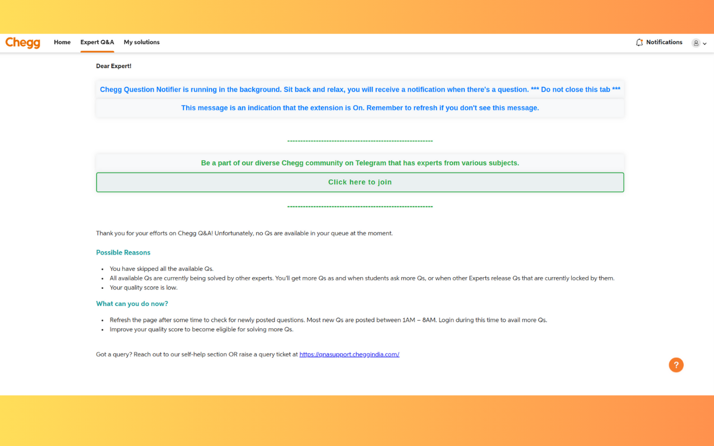

# Chegg Update Notifier

🚀 Introducing Chegg Update Notifier! 🚀

Struggling to keep up with new questions on Chegg? Our Chrome extension is here to help!

## Key Features ✨

- **Automatic Page Refresh**: Always stay updated with the latest questions.
- **Real-Time Notifications**: Get instant alerts for new questions.
- **Customizable Settings**: Tailor notifications to your needs.

## Demo

## Installation 🔗

Streamline your Chegg experience and never miss a question again. Install now and boost your productivity! 💪

[Download Chegg Update Notifier](https://chromewebstore.google.com/detail/chegg-update-notifier/kdbfadpcdadkaflcplcpglibdfclpljb)

## How to Use

1. **Install the Extension**: Click on the download link and install the Chegg Update Notifier from the Chrome Web Store.
2. **Configure Settings**: Customize the notification settings according to your preferences.
3. **Stay Updated**: Receive real-time notifications for new questions and keep your page automatically refreshed.

## License

This project is licensed under the MIT License - see the  file for details.

## Contact

For any queries or feedback, please reach out to us at https://t.me/cheggnx.

---

Thank you for using Chegg Update Notifier! We hope it enhances your Chegg experience. 🚀
